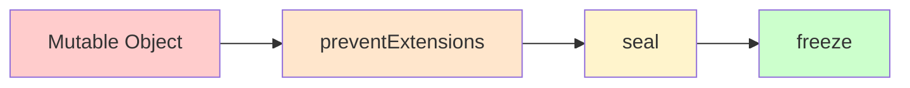

## What is an Object?

Objects are used to store various keyed collections and more complex entities in JavaScript. They are one of the fundamental data structures in the language.

**Key characteristics:**
- Store data as key-value pairs
- Keys must be either a **String** or a **Symbol**
- Values can be any type
- Objects are passed by reference
- Mutable by default

```js
// Simple object example
let person = {
  name: 'John',
  age: 30,
  isActive: true
}
```

---

## Creating Objects

There are multiple ways to create objects in JavaScript:

### 1. Object Literal (Recommended)

```js
let obj = {} // empty object
let person = {
  firstName: 'Raj',
  lastName: 'Kumar',
  age: 25
}
```

### 2. Object Constructor

```js
let obj = new Object() // less common
```

### 3. Object.create()

```js
// Create object with specific prototype
let proto = { greet() { return 'Hello' } }
let obj = Object.create(proto)
```

### 4. Constructor Function

```js
function Person(name, age) {
  this.name = name
  this.age = age
}

let person = new Person('John', 30)
```

### 5. ES6 Class

```js
class Person {
  constructor(name, age) {
    this.name = name
    this.age = age
  }
}

let person = new Person('John', 30)
```

---

## Accessing Object Properties

There are two ways to access object properties:

### 1. Dot Notation

Use when you know the property name at write-time:

```js
let obj = {
  firstName: 'Raj',
  lastName: 'Kumar'
}

obj.firstName // "Raj"
obj.lastName  // "Kumar"
```

### 2. Bracket Notation

Use when accessing properties dynamically or with special characters:

```js
let obj = {
  firstName: 'Raj',
  lastName: 'Kumar',
  'full name': 'Raj Kumar' // property with space
}

// Dynamic access
obj['lastName'] // "Kumar"

// Property with special characters
obj['full name'] // "Raj Kumar"

// Computed property names
let prop = 'firstName'
obj[prop] // "Raj"

// Properties with numbers or variables
let key = 'age'
obj[key] = 25
```

### When to use each:

| Dot Notation | Bracket Notation |
|--------------|------------------|
| Static property names | Dynamic property names |
| Valid JavaScript identifiers | Special characters in keys |
| More readable | Computed values |
| `obj.name` | `obj['prop-name']` or `obj[variable]` |

---

## Object Static Methods

### Object.assign()

Copies all enumerable own properties from one or more source objects to a target object. Returns the modified target object.

**Syntax:** `Object.assign(target, ...sources)`

```js
let o1 = { a: 1 }
let o2 = { b: 2 }
let o3 = { c: 3 }

let obj = Object.assign(o1, o2, o3)
console.log(obj) // { a: 1, b: 2, c: 3 }
console.log(o1)  // { a: 1, b: 2, c: 3 } - target object is modified!

// Copying an object (create new object as target)
let original = { x: 1, y: 2 }
let copied = Object.assign({}, original)
console.log(copied) // { x: 1, y: 2 }

// Merging objects
let defaults = { color: 'blue', size: 'medium' }
let options = { size: 'large', price: 100 }
let config = Object.assign({}, defaults, options)
console.log(config) // { color: 'blue', size: 'large', price: 100 }
```

**Modern Alternative - Spread Syntax (Recommended):**

```js
let copied = { ...original }
let merged = { ...defaults, ...options }
```

**Important Notes:**
- Only copies enumerable own properties
- Performs shallow copy (nested objects are referenced)
- Later sources override earlier ones
- Modifies the target object

---

### Object.defineProperty() / defineProperties()

Define new or modify existing properties with specific descriptors.

**Property Descriptors:**
- `value` - The value associated with the property
- `writable` - Can the value be changed? (default: false)
- `enumerable` - Will it show in loops? (default: false)
- `configurable` - Can it be deleted or modified? (default: false)
- `get` - Getter function
- `set` - Setter function

#### Object.defineProperty()

Define a single property:

```js
let obj = {}

Object.defineProperty(obj, 'property1', {
  value: 42,
  writable: false,
  enumerable: true,
  configurable: false
})

console.log(obj.property1) // 42
obj.property1 = 100        // No effect (not writable)
console.log(obj.property1) // 42
```

#### Object.defineProperties()

Define multiple properties at once:

```js
let obj = {}

Object.defineProperties(obj, {
  property1: {
    value: 42,
    writable: true,
    enumerable: true
  },
  property2: {
    value: 'Hello',
    writable: false
  },
  property3: {
    get() { return this._value },
    set(val) { this._value = val * 2 }
  }
})

console.log(obj.property1) // 42
console.log(obj.property2) // "Hello"
obj.property3 = 10
console.log(obj.property3) // 20
```

**Use Cases:**
- Creating read-only properties
- Hiding properties from enumeration
- Creating getters and setters
- Preventing property deletion

---

### Object.entries() / keys() / values()

Extract arrays from object properties:

```js
let obj = { a: 1, b: 2, c: 3 }

// Object.entries() - array of [key, value] pairs
Object.entries(obj) // [['a', 1], ['b', 2], ['c', 3]]

// Object.keys() - array of keys
Object.keys(obj)    // ['a', 'b', 'c']

// Object.values() - array of values
Object.values(obj)  // [1, 2, 3]
```

**Practical Examples:**

```js
let user = {
  name: 'Alice',
  age: 30,
  city: 'NYC'
}

// Iterate over entries
for (let [key, value] of Object.entries(user)) {
  console.log(`${key}: ${value}`)
}
// name: Alice
// age: 30
// city: NYC

// Filter object properties
let filtered = Object.entries(user)
  .filter(([key, value]) => typeof value === 'string')
  .reduce((obj, [key, value]) => ({ ...obj, [key]: value }), {})
console.log(filtered) // { name: 'Alice', city: 'NYC' }

// Check if object is empty
Object.keys(obj).length === 0 // false

// Count properties
Object.keys(obj).length // 3
```

---

### Object.fromEntries()

Transform a list of key-value pairs into an object (reverse of `Object.entries()`):

```js
// From array of arrays
let entries = [['foo', 'bar'], ['baz', 42]]
let obj = Object.fromEntries(entries)
console.log(obj) // { foo: 'bar', baz: 42 }

// From Map
let map = new Map([
  ['name', 'John'],
  ['age', 30]
])
let obj2 = Object.fromEntries(map)
console.log(obj2) // { name: 'John', age: 30 }

// Practical: Transform object values
let prices = { apple: 100, banana: 50, orange: 75 }
let discounted = Object.fromEntries(
  Object.entries(prices).map(([key, value]) => [key, value * 0.9])
)
console.log(discounted) // { apple: 90, banana: 45, orange: 67.5 }

// Practical: Filter object
let user = { name: 'John', age: 30, password: 'secret' }
let safe = Object.fromEntries(
  Object.entries(user).filter(([key]) => key !== 'password')
)
console.log(safe) // { name: 'John', age: 30 }
```

---

### Object.freeze() / isFrozen()

Freeze an object to make it completely immutable.

**What freeze does:**
- ❌ Cannot add new properties
- ❌ Cannot delete existing properties
- ❌ Cannot change existing values
- ❌ Cannot change property descriptors
- ❌ Cannot change prototype

```js
let obj = { prop: 42 }

Object.isFrozen(obj) // false

Object.freeze(obj)

Object.isFrozen(obj) // true

// All of these operations will fail silently (or throw in strict mode)
obj.prop = 33        // No effect
obj.newProp = 'test' // No effect
delete obj.prop      // No effect

console.log(obj.prop) // 42
```

**Strict Mode Behavior:**

```js
'use strict'

let obj = { prop: 42 }
Object.freeze(obj)

obj.prop = 33 // TypeError: Cannot assign to read only property
```

**Important Notes:**
- Freeze is **shallow** - nested objects are not frozen
- Returns the same object (for chaining)
- Irreversible - cannot unfreeze

```js
let obj = {
  inner: { value: 10 }
}

Object.freeze(obj)

obj.inner = {}           // Fails (cannot replace inner)
obj.inner.value = 20     // Works! (inner object not frozen)

console.log(obj.inner.value) // 20

// Deep freeze solution
function deepFreeze(obj) {
  Object.freeze(obj)
  Object.values(obj).forEach(value => {
    if (typeof value === 'object' && value !== null) {
      deepFreeze(value)
    }
  })
  return obj
}
```

---

### Object.seal() / isSealed()

Seal an object to prevent adding or removing properties, but allow modifying existing ones.

**What seal does:**
- ❌ Cannot add new properties
- ❌ Cannot delete existing properties
- ✅ Can change existing values (if writable)
- ❌ Cannot change property descriptors

```js
let obj = { prop: 42 }

Object.isSealed(obj) // false

Object.seal(obj)

Object.isSealed(obj) // true

// Can modify existing properties
obj.prop = 33
console.log(obj.prop) // 33

// Cannot add new properties
obj.newProp = 'test'
console.log(obj.newProp) // undefined

// Cannot delete properties
delete obj.prop
console.log(obj.prop) // 33 (still there)
```

**Comparison with freeze:**

```js
let frozen = Object.freeze({ a: 1 })
let sealed = Object.seal({ a: 1 })

frozen.a = 2  // No effect
sealed.a = 2  // Works!

console.log(frozen.a) // 1
console.log(sealed.a) // 2
```

---

### Object.preventExtensions() / isExtensible()

Prevent new properties from being added to an object, but allow deletion and modification.

**What preventExtensions does:**
- ❌ Cannot add new properties
- ✅ Can delete existing properties
- ✅ Can modify existing properties
- ✅ Can change property descriptors

```js
let obj = {}

Object.isExtensible(obj) // true

Object.preventExtensions(obj)

Object.isExtensible(obj) // false

// Cannot add new properties
obj.property1 = 42
console.log(obj.property1) // undefined

// Throws error with defineProperty
Object.defineProperty(obj, 'property1', { 
  value: 42 
}) // TypeError: Cannot define property, object is not extensible
```

**Example with existing properties:**

```js
let obj = { a: 1, b: 2 }

Object.preventExtensions(obj)

obj.a = 10         // Works (can modify)
delete obj.b       // Works (can delete)
obj.c = 3          // Fails (cannot add)

console.log(obj)   // { a: 10 }
```

---

### Object.hasOwnProperty()

Check if an object has a specific property as its own (not inherited):

```js
let obj = { a: 1, b: 2, c: 3 }

obj.hasOwnProperty('a')  // true
obj.hasOwnProperty('d')  // false

// Check inherited properties
obj.hasOwnProperty('toString')  // false (inherited from Object.prototype)
'toString' in obj               // true (checks inherited too)
```

**Better Alternative - Object.hasOwn() (ES2022):**

```js
// Modern approach (safer)
Object.hasOwn(obj, 'a')  // true

// Why it's better:
let obj = Object.create(null) // No prototype
obj.hasOwnProperty('a')       // TypeError!
Object.hasOwn(obj, 'a')       // Works fine - false
```

**Practical Use:**

```js
let user = { name: 'John', age: 30 }

// Safe property checking
if (Object.hasOwn(user, 'name')) {
  console.log(`Name: ${user.name}`)
}

// Iterate only own properties
for (let key in user) {
  if (Object.hasOwn(user, key)) {
    console.log(`${key}: ${user[key]}`)
  }
}
```

---

### Object.is()

Determine whether two values are the same value. Similar to `===` but with special handling for `NaN` and `-0`.

```js
// Same as === for most values
Object.is(25, 25)                // true
Object.is('foo', 'foo')          // true
Object.is('foo', 'bar')          // false
Object.is(null, null)            // true
Object.is(undefined, undefined)  // true

// Objects compared by reference
Object.is([], [])                // false
let obj = { a: 1 }
Object.is(obj, obj)              // true

// Special case: NaN
Object.is(NaN, NaN)              // true (unlike ===)
NaN === NaN                      // false

// Special case: +0 vs -0
Object.is(0, -0)                 // false (unlike ===)
0 === -0                         // true
Object.is(+0, -0)                // false
Object.is(-0, -0)                // true
```

**When to use Object.is():**
- When you need to distinguish `+0` from `-0`
- When comparing `NaN` values
- For all other cases, `===` is more common and slightly faster

---

## Object Immutability Levels

JavaScript provides three levels of object immutability:



| Method | Add Props | Delete Props | Modify Props | Configurable |
|--------|-----------|--------------|--------------|--------------|
| **preventExtensions** | ❌ | ✅ | ✅ | ✅ |
| **seal** | ❌ | ❌ | ✅ | ❌ |
| **freeze** | ❌ | ❌ | ❌ | ❌ |

```js
let obj = { a: 1, b: 2 }

// Level 1: Prevent Extensions
Object.preventExtensions(obj)
obj.c = 3       // ❌ Fails
delete obj.a    // ✅ Works
obj.b = 20      // ✅ Works

// Level 2: Seal (prevent extensions + no deletion)
let obj2 = { a: 1, b: 2 }
Object.seal(obj2)
obj2.c = 3      // ❌ Fails
delete obj2.a   // ❌ Fails
obj2.b = 20     // ✅ Works

// Level 3: Freeze (seal + no modification)
let obj3 = { a: 1, b: 2 }
Object.freeze(obj3)
obj3.c = 3      // ❌ Fails
delete obj3.a   // ❌ Fails
obj3.b = 20     // ❌ Fails
```

**Visual Summary:**

```js
const obj = { value: 1 }

// Normal object
obj.value = 2        // ✅
obj.newProp = 3      // ✅
delete obj.value     // ✅

// preventExtensions
Object.preventExtensions(obj)
obj.value = 2        // ✅
obj.newProp = 3      // ❌
delete obj.value     // ✅

// seal (includes preventExtensions)
Object.seal(obj)
obj.value = 2        // ✅
obj.newProp = 3      // ❌
delete obj.value     // ❌

// freeze (includes seal)
Object.freeze(obj)
obj.value = 2        // ❌
obj.newProp = 3      // ❌
delete obj.value     // ❌
```

---

## Object Iteration Methods

### 1. for...in Loop

Iterates over enumerable properties (including inherited):

```js
let obj = { a: 1, b: 2, c: 3 }

for (let key in obj) {
  console.log(`${key}: ${obj[key]}`)
}
// a: 1
// b: 2
// c: 3

// Skip inherited properties
for (let key in obj) {
  if (Object.hasOwn(obj, key)) {
    console.log(`${key}: ${obj[key]}`)
  }
}
```

### 2. Object.keys() / values() / entries()

```js
let obj = { a: 1, b: 2, c: 3 }

// Iterate over keys
Object.keys(obj).forEach(key => {
  console.log(key)
})

// Iterate over values
Object.values(obj).forEach(value => {
  console.log(value)
})

// Iterate over entries
Object.entries(obj).forEach(([key, value]) => {
  console.log(`${key}: ${value}`)
})
```

### 3. for...of with entries()

```js
let obj = { a: 1, b: 2, c: 3 }

for (let [key, value] of Object.entries(obj)) {
  console.log(`${key}: ${value}`)
}
```

### 4. Object.getOwnPropertyNames()

Get all own properties (including non-enumerable):

```js
let obj = Object.create({}, {
  visible: { value: 1, enumerable: true },
  hidden: { value: 2, enumerable: false }
})

Object.keys(obj)                  // ['visible']
Object.getOwnPropertyNames(obj)   // ['visible', 'hidden']
```

---

## Advanced Object Concepts

### Property Descriptors

Every property has a descriptor object with metadata:

```js
let obj = { name: 'John' }

let descriptor = Object.getOwnPropertyDescriptor(obj, 'name')
console.log(descriptor)
// {
//   value: 'John',
//   writable: true,
//   enumerable: true,
//   configurable: true
// }

// Get all descriptors
Object.getOwnPropertyDescriptors(obj)
```

### Getters and Setters

```js
let user = {
  firstName: 'John',
  lastName: 'Doe',
  
  get fullName() {
    return `${this.firstName} ${this.lastName}`
  },
  
  set fullName(value) {
    [this.firstName, this.lastName] = value.split(' ')
  }
}

console.log(user.fullName)  // "John Doe"
user.fullName = 'Jane Smith'
console.log(user.firstName) // "Jane"
```

### Object Prototype

```js
let animal = {
  eats: true,
  walk() {
    console.log('Animal walks')
  }
}

let rabbit = Object.create(animal)
rabbit.jumps = true

console.log(rabbit.eats)  // true (inherited)
console.log(rabbit.jumps) // true (own property)

// Check prototype
Object.getPrototypeOf(rabbit) === animal  // true
```

### Property Enumeration

```js
let obj = {}

Object.defineProperty(obj, 'hidden', {
  value: 'secret',
  enumerable: false
})

Object.defineProperty(obj, 'visible', {
  value: 'public',
  enumerable: true
})

console.log(Object.keys(obj))           // ['visible']
console.log(Object.values(obj))         // ['public']

// for...in also skips non-enumerable
for (let key in obj) {
  console.log(key)  // Only logs 'visible'
}
```

### Object Destructuring

```js
let user = {
  name: 'John',
  age: 30,
  city: 'NYC'
}

// Basic destructuring
let { name, age } = user

// Rename variables
let { name: userName, age: userAge } = user

// Default values
let { country = 'USA' } = user

// Rest properties
let { name, ...rest } = user
console.log(rest)  // { age: 30, city: 'NYC' }

// Nested destructuring
let user2 = {
  name: 'John',
  address: { city: 'NYC', zip: '10001' }
}
let { address: { city, zip } } = user2
```

### Computed Property Names

```js
let prop = 'name'
let value = 'John'

// ES6 computed property names
let obj = {
  [prop]: value,
  ['age']: 30,
  [`${prop}Upper`]: value.toUpperCase()
}

console.log(obj)  // { name: 'John', age: 30, nameUpper: 'JOHN' }
```

### Shorthand Properties

```js
let name = 'John'
let age = 30

// ES6 shorthand
let user = { name, age }
// Same as: { name: name, age: age }

// Method shorthand
let obj = {
  // Old way
  greet: function() { return 'Hello' },
  
  // New way
  hello() { return 'Hi' }
}
```

---

## Best Practices

### 1. Prefer Object Literals

```js
// ✅ Good
let obj = {}

// ❌ Avoid
let obj = new Object()
```

### 2. Use Spread for Copying

```js
// ✅ Good (shallow copy)
let copy = { ...original }

// ⚠️ Less modern
let copy = Object.assign({}, original)
```

### 3. Use Optional Chaining

```js
let user = {
  profile: { name: 'John' }
}

// ✅ Good (safe access)
let name = user?.profile?.name

// ❌ Verbose
let name = user && user.profile && user.profile.name
```

### 4. Use Nullish Coalescing

```js
// ✅ Good (only null/undefined)
let value = obj.prop ?? 'default'

// ⚠️ Different behavior (also catches 0, '', false)
let value = obj.prop || 'default'
```

### 5. Validate Object Properties

```js
// ✅ Good
if (Object.hasOwn(obj, 'prop')) {
  // use obj.prop
}

// ⚠️ Less safe
if (obj.hasOwnProperty('prop')) {
  // may fail if obj has no prototype
}
```

### 6. Deep Clone When Needed

```js
// Shallow copy (only copies first level)
let shallow = { ...obj }

// Deep clone (handles nested objects)
let deep = JSON.parse(JSON.stringify(obj))  // Simple but limited

// Better: Use structuredClone (modern browsers)
let deep = structuredClone(obj)
```

### 7. Make Constants Immutable

```js
// ✅ Good
const CONFIG = Object.freeze({
  API_URL: 'https://api.example.com',
  TIMEOUT: 5000
})

// ❌ Can still be modified
const CONFIG = {
  API_URL: 'https://api.example.com',
  TIMEOUT: 5000
}
CONFIG.API_URL = 'changed'  // Works!
```

### 8. Use Descriptive Property Names

```js
// ✅ Good
let user = {
  firstName: 'John',
  dateOfBirth: '1990-01-01',
  isActive: true
}

// ❌ Unclear
let user = {
  fn: 'John',
  dob: '1990-01-01',
  act: true
}
```

---

## Object.groupBy() (ES2024)

Group array elements into an object based on a callback function.

```js
const inventory = [
  { name: 'asparagus', type: 'vegetables', quantity: 5 },
  { name: 'bananas', type: 'fruit', quantity: 0 },
  { name: 'goat', type: 'meat', quantity: 23 },
  { name: 'cherries', type: 'fruit', quantity: 5 },
  { name: 'fish', type: 'meat', quantity: 22 }
]

// Group by type
const result = Object.groupBy(inventory, ({ type }) => type)

console.log(result)
// {
//   vegetables: [{ name: 'asparagus', type: 'vegetables', quantity: 5 }],
//   fruit: [
//     { name: 'bananas', type: 'fruit', quantity: 0 },
//     { name: 'cherries', type: 'fruit', quantity: 5 }
//   ],
//   meat: [
//     { name: 'goat', type: 'meat', quantity: 23 },
//     { name: 'fish', type: 'meat', quantity: 22 }
//   ]
// }

// Group by condition
const byAvailability = Object.groupBy(inventory, (item) => 
  item.quantity > 0 ? 'in-stock' : 'out-of-stock'
)

console.log(byAvailability)
// {
//   'in-stock': [...],
//   'out-of-stock': [{ name: 'bananas', type: 'fruit', quantity: 0 }]
// }
```

---

## structuredClone()

Create deep copies of objects (including nested objects, arrays, dates, etc.).

```js
const original = {
  name: 'John',
  address: { city: 'NYC', zip: '10001' },
  hobbies: ['reading', 'gaming'],
  createdAt: new Date()
}

// Deep clone (better than JSON.parse/stringify)
const clone = structuredClone(original)

clone.address.city = 'LA'
clone.hobbies.push('coding')

console.log(original.address.city)  // 'NYC' (unchanged!)
console.log(original.hobbies)       // ['reading', 'gaming'] (unchanged!)
console.log(clone.createdAt instanceof Date)  // true (preserves type!)

// What it handles that JSON.stringify doesn't:
const complex = {
  date: new Date(),
  regex: /test/g,
  map: new Map([['key', 'value']]),
  set: new Set([1, 2, 3]),
  undefined: undefined,
  func: function() {}  // Functions are not cloned (omitted)
}

const cloned = structuredClone(complex)
console.log(cloned.date instanceof Date)  // true
console.log(cloned.map instanceof Map)    // true
```

**Limitations:**
- Cannot clone functions
- Cannot clone DOM nodes
- Cannot clone symbols as property keys
- Cannot clone objects with getters/setters

---

## Object Property Symbols

Use Symbols as object property keys for unique, non-enumerable properties.

```js
// Create unique property keys
const id = Symbol('id')
const secret = Symbol('secret')

let user = {
  name: 'John',
  [id]: 12345,
  [secret]: 'password123'
}

console.log(user[id])     // 12345
console.log(user.name)    // 'John'

// Symbols are hidden from normal iteration
Object.keys(user)         // ['name']
Object.values(user)       // ['John']
JSON.stringify(user)      // '{"name":"John"}'

// But can be accessed with specific methods
Object.getOwnPropertySymbols(user)  // [Symbol(id), Symbol(secret)]

// Use case: Adding metadata without conflicts
const metadata = Symbol('metadata')
let article = {
  title: 'JavaScript',
  content: '...',
  [metadata]: { views: 1000, likes: 50 }
}
```

---

## WeakMap and WeakRef

### WeakMap

A Map-like structure where keys are weakly referenced (can be garbage collected).

```js
let weakMap = new WeakMap()

let obj = { name: 'John' }
weakMap.set(obj, 'some metadata')

console.log(weakMap.get(obj))  // 'some metadata'

// When obj is no longer referenced, it can be garbage collected
obj = null  // The entry in weakMap is automatically removed

// Use case: Store private data
const privateData = new WeakMap()

class User {
  constructor(name) {
    this.name = name
    privateData.set(this, { password: 'secret123' })
  }
  
  getPassword() {
    return privateData.get(this).password
  }
}

let user = new User('John')
console.log(user.getPassword())  // 'secret123'
console.log(user.password)       // undefined (truly private!)
```

**Key differences from Map:**
- Keys must be objects (not primitives)
- Keys are weakly held (can be garbage collected)
- Not enumerable (no `.size`, `.keys()`, `.values()`)
- Cannot be iterated

### WeakRef

Hold a weak reference to an object without preventing garbage collection.

```js
let target = { data: 'important' }
let weakRef = new WeakRef(target)

// Access the object
let obj = weakRef.deref()
if (obj) {
  console.log(obj.data)  // 'important'
}

// When target is collected, deref() returns undefined
target = null
// Later, after garbage collection
let obj2 = weakRef.deref()
console.log(obj2)  // undefined
```

---

## Object.setPrototypeOf() and Object.getPrototypeOf()

Manipulate object prototypes dynamically.

```js
let animal = {
  eats: true,
  walk() {
    console.log('Animal walks')
  }
}

let rabbit = {
  jumps: true
}

// Set prototype
Object.setPrototypeOf(rabbit, animal)

console.log(rabbit.eats)   // true (inherited)
rabbit.walk()              // 'Animal walks'

// Get prototype
console.log(Object.getPrototypeOf(rabbit) === animal)  // true

// Check if object is in prototype chain
console.log(animal.isPrototypeOf(rabbit))  // true
```

**Note:** `Object.setPrototypeOf()` is slow - prefer `Object.create()` when creating objects.

---

## Proxy and Reflect

Create powerful object wrappers with custom behavior.

### Proxy

Intercept and customize operations on objects.

```js
let target = {
  message: 'Hello'
}

let handler = {
  get(target, property) {
    console.log(`Reading ${property}`)
    return property in target ? target[property] : 'Not found'
  },
  
  set(target, property, value) {
    console.log(`Writing ${property} = ${value}`)
    if (property === 'age' && typeof value !== 'number') {
      throw new TypeError('Age must be a number')
    }
    target[property] = value
    return true
  },
  
  has(target, property) {
    console.log(`Checking ${property}`)
    return property in target
  },
  
  deleteProperty(target, property) {
    console.log(`Deleting ${property}`)
    delete target[property]
    return true
  }
}

let proxy = new Proxy(target, handler)

proxy.message          // Reading message -> 'Hello'
proxy.age = 30         // Writing age = 30
proxy.age = 'thirty'   // TypeError: Age must be a number
'message' in proxy     // Checking message -> true
delete proxy.message   // Deleting message
```

**Common Use Cases:**

```js
// 1. Validation
let validator = {
  set(target, property, value) {
    if (property === 'age') {
      if (!Number.isInteger(value) || value < 0 || value > 150) {
        throw new RangeError('Invalid age')
      }
    }
    target[property] = value
    return true
  }
}

let person = new Proxy({}, validator)
person.age = 30   // OK
person.age = -1   // RangeError

// 2. Default values
let withDefaults = new Proxy({}, {
  get(target, property) {
    return property in target ? target[property] : 'N/A'
  }
})

withDefaults.name      // 'N/A'
withDefaults.name = 'John'
withDefaults.name      // 'John'

// 3. Array negative indexing
function negativeArray(array) {
  return new Proxy(array, {
    get(target, property) {
      let index = Number(property)
      if (index < 0) {
        property = target.length + index
      }
      return target[property]
    }
  })
}

let arr = negativeArray([1, 2, 3, 4, 5])
console.log(arr[-1])  // 5
console.log(arr[-2])  // 4

// 4. Observable objects
function observable(target, onChange) {
  return new Proxy(target, {
    set(target, property, value) {
      target[property] = value
      onChange(property, value)
      return true
    }
  })
}

let user = observable({}, (prop, val) => {
  console.log(`${prop} changed to ${val}`)
})

user.name = 'John'  // name changed to John
user.age = 30       // age changed to 30
```

### Reflect

Perform object operations programmatically (companion to Proxy).

```js
let obj = { x: 1, y: 2 }

// Instead of direct operations
obj.x                    // 1
obj.x = 10
delete obj.y
'x' in obj              // true

// Use Reflect (especially useful in Proxy handlers)
Reflect.get(obj, 'x')              // 1
Reflect.set(obj, 'x', 10)          // true
Reflect.deleteProperty(obj, 'y')   // true
Reflect.has(obj, 'x')              // true

// Other Reflect methods
Reflect.ownKeys(obj)               // ['x']
Reflect.getPrototypeOf(obj)        // Object.prototype
Reflect.setPrototypeOf(obj, null)  // true
```

**Why use Reflect?**
- Consistent return values (boolean success/failure)
- Better error handling
- Mirrors Proxy traps exactly
- More functional approach

---

## Object Property Attributes in Detail

### Enumerable

Controls whether property appears in iterations.

```js
let obj = {}

Object.defineProperty(obj, 'hidden', {
  value: 'secret',
  enumerable: false
})

Object.defineProperty(obj, 'visible', {
  value: 'public',
  enumerable: true
})

for (let key in obj) {
  console.log(key)  // Only 'visible'
}

Object.keys(obj)         // ['visible']
Object.values(obj)       // ['public']
JSON.stringify(obj)      // '{"visible":"public"}'

// But still accessible
console.log(obj.hidden)  // 'secret'

// Get all properties including non-enumerable
Object.getOwnPropertyNames(obj)  // ['hidden', 'visible']
```

### Writable

Controls whether property value can be changed.

```js
let obj = {}

Object.defineProperty(obj, 'constant', {
  value: 42,
  writable: false,
  configurable: true
})

obj.constant = 100       // Silently fails (strict mode: TypeError)
console.log(obj.constant)  // 42

// But can still be changed with defineProperty
Object.defineProperty(obj, 'constant', {
  value: 100
})
console.log(obj.constant)  // 100
```

### Configurable

Controls whether property can be deleted or its attributes changed.

```js
let obj = {}

Object.defineProperty(obj, 'permanent', {
  value: 'stuck',
  configurable: false
})

delete obj.permanent     // Silently fails (strict mode: TypeError)
console.log(obj.permanent)  // 'stuck'

// Cannot change attributes
Object.defineProperty(obj, 'permanent', {
  enumerable: true
})  // TypeError: Cannot redefine property

// Exception: writable can be changed from true to false
Object.defineProperty(obj, 'test', {
  value: 1,
  writable: true,
  configurable: false
})

Object.defineProperty(obj, 'test', {
  writable: false  // OK
})

Object.defineProperty(obj, 'test', {
  writable: true   // TypeError!
})
```

---

## Object.create() in Depth

Create objects with specific prototypes and properties.

```js
// Basic usage: create with prototype
let animal = {
  eats: true,
  walk() {
    console.log('Walking')
  }
}

let rabbit = Object.create(animal)
rabbit.jumps = true

console.log(rabbit.eats)   // true (from prototype)
console.log(rabbit.jumps)  // true (own property)

// Create with null prototype (no inherited properties)
let pureObject = Object.create(null)
pureObject.name = 'John'

console.log(pureObject.toString)  // undefined (no Object.prototype)
console.log(pureObject.name)      // 'John'

// Create with property descriptors
let user = Object.create(Object.prototype, {
  name: {
    value: 'John',
    writable: true,
    enumerable: true,
    configurable: true
  },
  age: {
    value: 30,
    writable: false
  }
})

// Use case: Inherit from another object
function inherit(proto) {
  return Object.create(proto)
}

// Use case: Create dictionary object (no prototype pollution)
let dict = Object.create(null)
dict['__proto__'] = 'value'  // Just a regular property
console.log(dict['__proto__'])  // 'value'
```

---

## Property Shorthands and Enhancements

### Method Definitions

```js
let obj = {
  // Old way
  sayHello: function() {
    return 'Hello'
  },
  
  // ES6 shorthand
  sayHi() {
    return 'Hi'
  },
  
  // Async methods
  async fetchData() {
    return await fetch('/api/data')
  },
  
  // Generator methods
  *generateNumbers() {
    yield 1
    yield 2
    yield 3
  }
}

// Use them
obj.sayHi()                    // 'Hi'
await obj.fetchData()
for (let num of obj.generateNumbers()) {
  console.log(num)  // 1, 2, 3
}
```

### Computed Property Names

```js
let prop = 'name'
let i = 0

let obj = {
  [prop]: 'John',                    // Computed from variable
  ['age']: 30,                       // Computed from string
  [`prop${++i}`]: 'value1',          // Dynamic computation
  [`prop${++i}`]: 'value2',
  [Symbol.toStringTag]: 'CustomObj'  // Symbol as key
}

console.log(obj)
// {
//   name: 'John',
//   age: 30,
//   prop1: 'value1',
//   prop2: 'value2',
//   [Symbol.toStringTag]: 'CustomObj'
// }
```

### Property Value Shorthand

```js
let name = 'John'
let age = 30
let city = 'NYC'

// Old way
let user1 = {
  name: name,
  age: age,
  city: city
}

// ES6 shorthand (when property name matches variable)
let user2 = { name, age, city }

console.log(user2)  // { name: 'John', age: 30, city: 'NYC' }

// Mix with other properties
let user3 = {
  name,
  age,
  country: 'USA',
  isActive: true
}
```

---

## Object Comparison and Equality

### Different Ways to Compare

```js
let obj1 = { a: 1 }
let obj2 = { a: 1 }
let obj3 = obj1

// Reference equality
obj1 === obj2     // false (different objects)
obj1 === obj3     // true (same reference)

// Object.is (same as === for objects)
Object.is(obj1, obj2)  // false
Object.is(obj1, obj3)  // true

// Deep equality (manual)
function deepEqual(obj1, obj2) {
  if (obj1 === obj2) return true
  
  if (typeof obj1 !== 'object' || typeof obj2 !== 'object' ||
      obj1 == null || obj2 == null) {
    return false
  }
  
  let keys1 = Object.keys(obj1)
  let keys2 = Object.keys(obj2)
  
  if (keys1.length !== keys2.length) return false
  
  for (let key of keys1) {
    if (!keys2.includes(key) || !deepEqual(obj1[key], obj2[key])) {
      return false
    }
  }
  
  return true
}

console.log(deepEqual({ a: 1 }, { a: 1 }))  // true
console.log(deepEqual({ a: { b: 2 } }, { a: { b: 2 } }))  // true

// Shallow comparison
function shallowEqual(obj1, obj2) {
  let keys1 = Object.keys(obj1)
  let keys2 = Object.keys(obj2)
  
  if (keys1.length !== keys2.length) return false
  
  for (let key of keys1) {
    if (obj1[key] !== obj2[key]) return false
  }
  
  return true
}

console.log(shallowEqual({ a: 1, b: 2 }, { a: 1, b: 2 }))  // true
console.log(shallowEqual({ a: { b: 1 } }, { a: { b: 1 } }))  // false
```

---

## Object Merging Strategies

### Shallow Merge

```js
let obj1 = { a: 1, b: 2 }
let obj2 = { b: 3, c: 4 }
let obj3 = { c: 5, d: 6 }

// Using spread (recommended)
let merged = { ...obj1, ...obj2, ...obj3 }
console.log(merged)  // { a: 1, b: 3, c: 5, d: 6 }

// Using Object.assign
let merged2 = Object.assign({}, obj1, obj2, obj3)
```

### Deep Merge

```js
function deepMerge(target, ...sources) {
  if (!sources.length) return target
  
  const source = sources.shift()
  
  if (typeof target === 'object' && typeof source === 'object') {
    for (let key in source) {
      if (typeof source[key] === 'object' && source[key] !== null) {
        if (!target[key]) Object.assign(target, { [key]: {} })
        deepMerge(target[key], source[key])
      } else {
        Object.assign(target, { [key]: source[key] })
      }
    }
  }
  
  return deepMerge(target, ...sources)
}

let obj1 = {
  a: 1,
  b: { x: 1, y: 2 }
}

let obj2 = {
  b: { y: 3, z: 4 },
  c: 5
}

let result = deepMerge({}, obj1, obj2)
console.log(result)
// { a: 1, b: { x: 1, y: 3, z: 4 }, c: 5 }
```

---

## Object Serialization

### JSON Methods

```js
let obj = {
  name: 'John',
  age: 30,
  active: true,
  tags: ['developer', 'writer']
}

// Serialize
let json = JSON.stringify(obj)
console.log(json)
// '{"name":"John","age":30,"active":true,"tags":["developer","writer"]}'

// Deserialize
let parsed = JSON.parse(json)
console.log(parsed)

// With formatting
let formatted = JSON.stringify(obj, null, 2)
console.log(formatted)
// {
//   "name": "John",
//   "age": 30,
//   "active": true,
//   "tags": ["developer", "writer"]
// }

// Custom serialization
let user = {
  name: 'John',
  password: 'secret123',
  toJSON() {
    return {
      name: this.name
      // Exclude password
    }
  }
}

console.log(JSON.stringify(user))  // '{"name":"John"}'

// Replacer function
let data = {
  name: 'John',
  password: 'secret',
  age: 30
}

let safe = JSON.stringify(data, (key, value) => {
  if (key === 'password') return undefined
  return value
})

console.log(safe)  // '{"name":"John","age":30}'

// Reviver function
let text = '{"date":"2024-01-15T12:00:00.000Z"}'
let obj2 = JSON.parse(text, (key, value) => {
  if (key === 'date') return new Date(value)
  return value
})

console.log(obj2.date instanceof Date)  // true
```

---

## Object as Maps

While Map is preferred for key-value storage, objects can serve as simple maps.

```js
// Object as map
let scores = {}
scores['player1'] = 100
scores['player2'] = 200

console.log(scores['player1'])  // 100

// Issues with objects as maps:
// 1. Inherited properties
let map = {}
console.log(map.toString)  // [Function: toString]

// 2. Key type limitations (only strings/symbols)
let obj = {}
obj[1] = 'number key'     // Converted to string
obj[{ a: 1 }] = 'object'  // Becomes "[object Object]"

console.log(obj['1'])              // 'number key'
console.log(obj['[object Object]'])  // 'object'

// Solution: Use Map for true map behavior
let properMap = new Map()
properMap.set(1, 'number key')
properMap.set({ a: 1 }, 'object key')

console.log(properMap.get(1))  // 'number key'

// Or use Object.create(null) for clean objects
let cleanMap = Object.create(null)
cleanMap['key'] = 'value'
console.log(cleanMap.toString)  // undefined (no inherited properties)
```

---

## Performance Considerations

### Property Access

```js
// Dot notation is slightly faster
obj.property      // Faster

// Bracket notation requires evaluation
obj['property']   // Slightly slower

// But differences are negligible for most use cases
```

### Object Creation

```js
// Object literal (fastest)
let obj1 = { a: 1, b: 2 }

// Constructor (slower)
let obj2 = new Object()
obj2.a = 1
obj2.b = 2

// Object.create (useful for inheritance)
let obj3 = Object.create(null)
obj3.a = 1
```

### Property Deletion

```js
let obj = { a: 1, b: 2, c: 3 }

// Delete is slow (changes object structure)
delete obj.b

// Better: Set to undefined (keeps structure)
obj.b = undefined

// Or use Map if frequent deletions needed
let map = new Map([['a', 1], ['b', 2], ['c', 3]])
map.delete('b')  // Efficient
```

### Frozen Objects

```js
// Frozen objects can be optimized by JS engines
const CONFIG = Object.freeze({
  API_URL: 'https://api.example.com',
  TIMEOUT: 5000
})

// Engine knows CONFIG won't change and can optimize
```